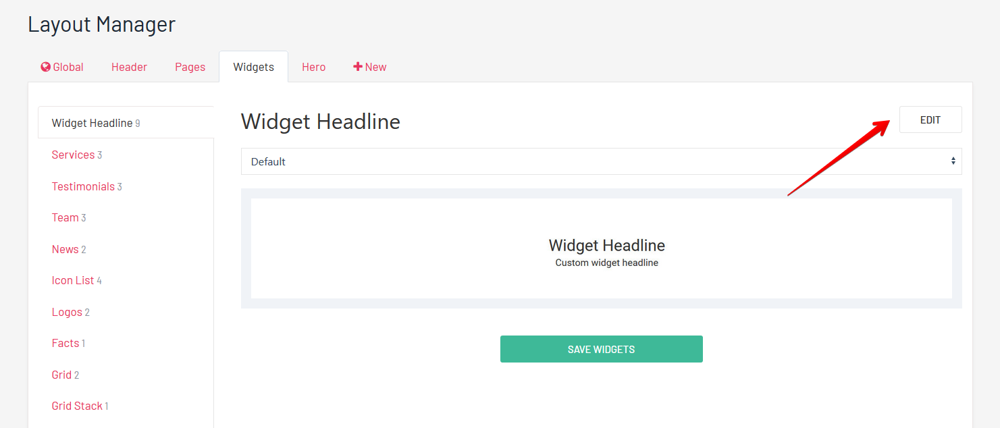
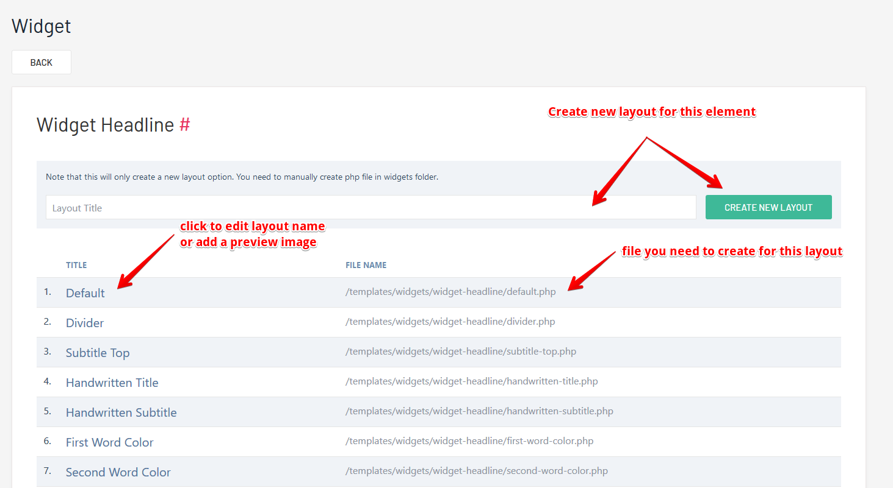

# Layouts

Easiest way to customize existing elements (pages, widgets...) and markup, is by creating new layouts.

:::tip Layout Manager
Create new widgets and pages layouts, directly from layout manager.
:::

## Create New Layout Option

On the layout manager page, each element have the edit button, hit this button to check available layouts and to create new ones.  

On the layout edit page you can click on a layout title to edit it (*rename, change/add preview image*), or you can use the form to add new layouts for this element.

## Create New Layout File
**Note** that previews steps only create layout-manager option, you need to create layout php file manually. File needs to be the same name as your layout and lowercase. Spaces are replaced with "-": `My Layout = my-layout.php`    

:::tip Widgets Markup
***/templates/widgets/your_widget_name/layout_name.php***   
<small>This is always the same for widgets</small>
:::

:::tip Pages Markup
***/templates/markup/your_page_template_name/layout_name.php***.    
<small>This is relative for pages, they can be structured as u wish, some pages can have layout names as folder names, some pages may not have layouts at all.</small>
:::

:::warning Widget Headline Layouts
Widget headline layouts are actually located in ***/templates/widgets/_headline/***
:::

:::tip Copy Default
All elements have default layout. Easy way to create new layout file is to copy ***default.php***, rename it, and make modifications.
:::
