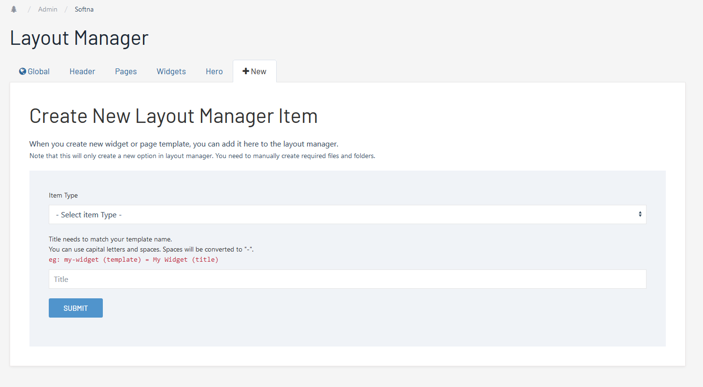

# Widgets

#### For new custom widget you need to:

* create new template
* assign new template to the widgets list,
* create widget view (php) file
* and optionally add it to layout manager.


## Create Widget Template

Go to ***setup > template***, create new template and assign fields to it.   
There is no required fields here (except title), but if you want your widget to support widget headline, you need to asign ***heading*** field to it.

If you are planning to add options to your widget, add ***TAB_options*** to your template and add all option fields under the option tab (*this is recommended*).

:::tip Options Tab
If u have options for your widget, always add them under options tab (***TAB_options***)
:::

Few more things to do:
* On **Family** tab, for ***Allowed template(s) for parents*** select **widgets**.
* On **Advanced** tab, add type in tag *Widgets* and select an icon below. If you want to use custom svg icon, upload it to */site/modules/softna-widgets/svg/* (icon needs to be have same name as your template).
* Save and close.
* Now we need to assign this new template to the widgets list. Edit **Widgets** template, go to **Family** tab and for ***Allowed template(s) for children*** select template you just created.
* Your new widget template is now ready...


## Create Layout Manager Option
In most cases when creating custom widget or a page template, you can skip this step. You probably not going to have multiple layouts for a custom page or widget. Only elements built-in to the cms core should have multiple layout options.

:::warning Optional
Layout manager is optional, if you are making custom element just for a current project, it's better to skip this step.
:::

But if you still want your widget to support multiple layouts, you need to create layout manager options for it:  

Go to layout manager page (dropdown menu on top right), and then click on ***+New*** tab.    
Select item type (widgets), enter title (title needs to be the same as template name) and that's it.   
This will add your new widget to the layout manager.




## Create Widget File

Last step is to create widget php file. File needs to be located in ***/widgets/*** folder, and needs to have same name as your widget template name.

```
├── widgets
    ├── my-widget.php
```

Use `$widget` variable to access your widget fields and options...

``` php
<?php
/**
 *  My Widget
 *  
 *  @var widget
 *
 */

?>

<h2 class="tm-css-title">
    <?= $widget->heading->title ?>
</h2>

<div class="tm-css-content">
    <?= $widget->body ?>
</div>

```

### For Multiple Layouts

If you decide to add your widget to the layout manager (see *Create Layout Manager Option*), you need to create widget folder and default layout file:
```
├── widgets
    ├── my-widget
        ├── default.php
    ├── my-widget.php
```
In this case your main widget file (eg: my-widget.php) would look like this:
``` php
<?php
/**
 *  My Widget
 *
 *  @var widget
 *
 */

$layout = $pages->get("/system/layout-manager/widgets/my-widget/")->layout_options->name;
include("./my-widget/{$layout}.php");
```

And default.php
``` php
<?php
/**
 *  My Widget Default
 *  
 *  @var widget
 *
 */

?>

<h2 class="tm-css-title">
    <?= $widget->heading->title ?>
</h2>

<div class="tm-css-content">
    <?= $widget->body ?>
</div>

```
